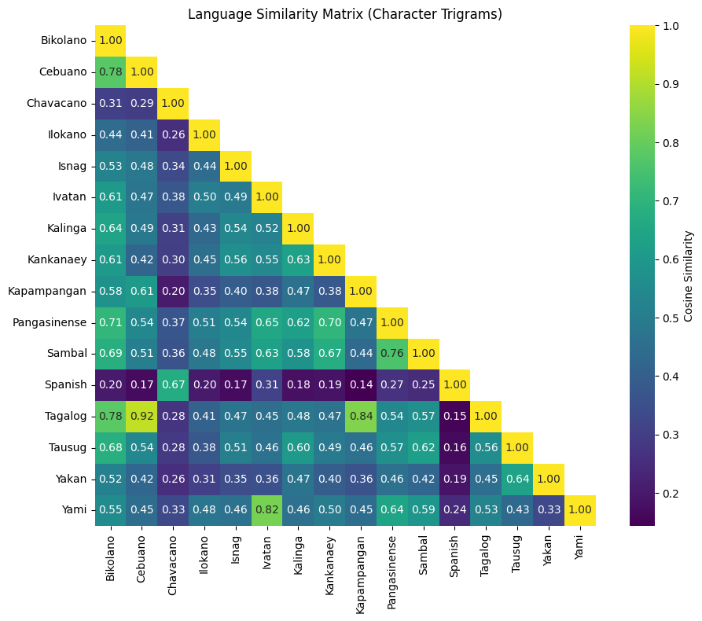
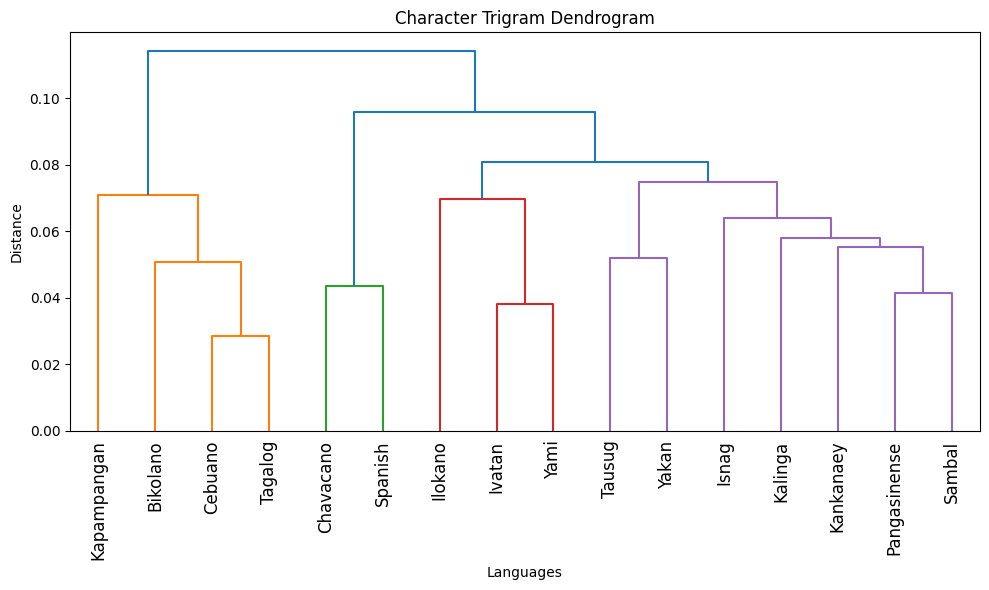
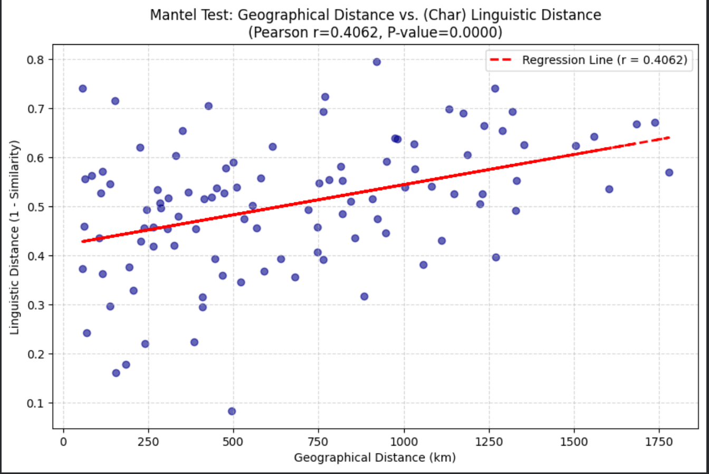

# philippine-language-clustering <!-- omit from toc -->

<!--  -->

<!-- Refer to https://shields.io/badges for usage -->

  

An exploration and analysis of relationships among various Philippine languages. Created for NLP1000 (Introduction to Natural Language Processing).

## Table of Contents <!-- omit from toc -->

- [1. Introduction](#1-introduction)
- [2. Running the Project](#2-running-the-project)
  - [2.1. Prerequisites](#21-prerequisites)
  - [2.2. Reproducing the Results](#22-reproducing-the-results)

## 1. Introduction

This project investigates linguistic relationships among sixteen Philippine languages using a data-driven computational approach. Biblical text corpora were scraped, cleaned, and normalized, then transformed into quantitative representations through character trigrams and word unigrams. After dimensionality reduction via Singular Value Decomposition (SVD), cosine similarity matrices were generated and used to construct hierarchical clusters that map cross-language patterns. The resulting groupings highlight well-known linguistic relationships, including the strong pairing of Ivatan and Yami, the clustering of Central/Meso-Philippine languages, and the distinct Spanish–Chavacano cluster reflecting historical contact. To examine the role of geography, provincial coordinates were used to compute pairwise distances, which were compared with linguistic distances through a Mantel test. Results reveal a moderate negative correlation, indicating that geographically closer languages tend to be more orthographically similar, though historical interactions also significantly shape similarity patterns. Overall, the findings demonstrate that computational methods can approximate established linguistic classifications while also exposing limitations of orthography-based models.





## 2. Running the Project

### 2.1. Prerequisites

To reproduce our results, you will need the following installed:

1. **Git:** Used to clone this repository.

2. **Python:** We require Python 3.13.x for this project. See <https://www.python.org/downloads/> for the latest Python 3.13 release and install it.

3. **uv:** The dependency manager we used. Install it by following the instructions at <https://docs.astral.sh/uv/getting-started/installation/>.

### 2.2. Reproducing the Results

1. Clone the repository:

   ```bash
   git clone https://github.com/qu1r0ra/philippine-machine-translation
   ```

2. Navigate to the project root and install all required dependencies:

   ```bash
   uv sync
   ```

3. Run through the ff. notebooks in `notebooks/` in the order listed below:

   1. `philippine_language_clustering.ipynb`
   2. `language_map_clustering.ipynb`

   Notes

   - When running a notebook, select `.venv` in root as the kernel.
   - Further instructions can be found in each notebook.
   - You do not need to run the notebooks that are not listed above as they are either experimental or deprecated.
